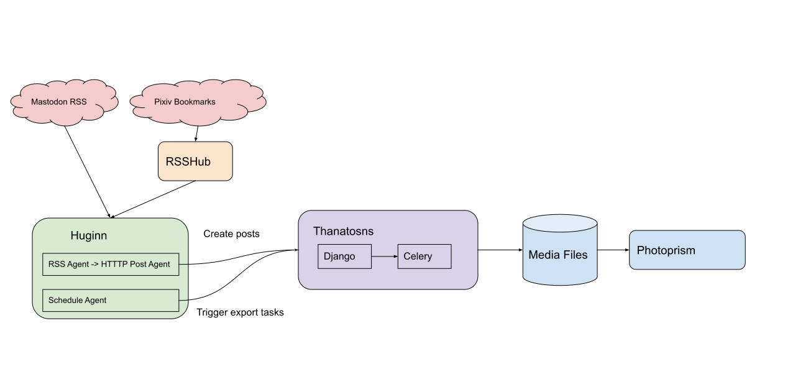

# Thanatosns
An SNS data management system.

## Features
* Simple CMS with CRUD APIs for archiving your SNS posts.
* Export SNS medias to files, with EXIF metadata from the SNS posts attached.

All interactions with the system are supposed to made through REST APIs or Django Admin. Interfaces:
* <web_host>/api/docs => Swagger UI
* <web_host>/admin => Django Admin UI
* <flower_host> => Flower UI to monitor Celery tasks (for exporting tasks)

## Use Cases

## Deployment
The deployment instructions are based on Docker:
* Modify the docker-compose.yaml as needed, mainly the path of the `data-export` volume.
* Modify the docker-compose.env as needed. `DJANGO_SECRET_KEY` will be generated later.
* Run `docker compose run --rm sh pdm run manage.py generate_secret_key`. Copy the secret key and put it into the `DJANGO_SECRET_KEY` in the docker-compose.env file.
* Run `docker compose run --rm sh pdm run manage.py migrate` to initialize the database schema.
* Run `docker compose run --rm sh pdm run manage.py createsuperuser --no-input` to create the admin user.
* Run `docker compose up -d` to bring up the whole service.

Note: The Docker image assumes that the containers are ran by the ROOT user (for rootless docker it's the user that runs the Docker daemon). It assumes the sysadmin either adopts the [Docker User Namespace mapping](https://docs.docker.com/engine/security/userns-remap/) or rootless Docker.
